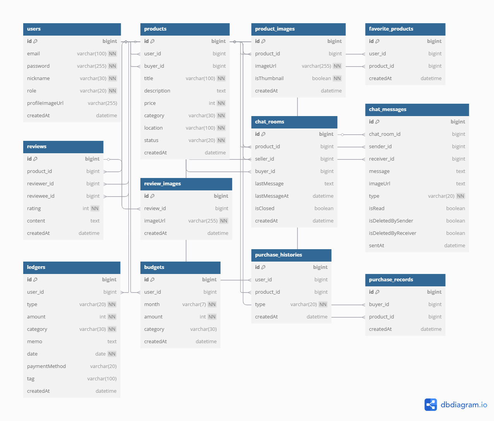
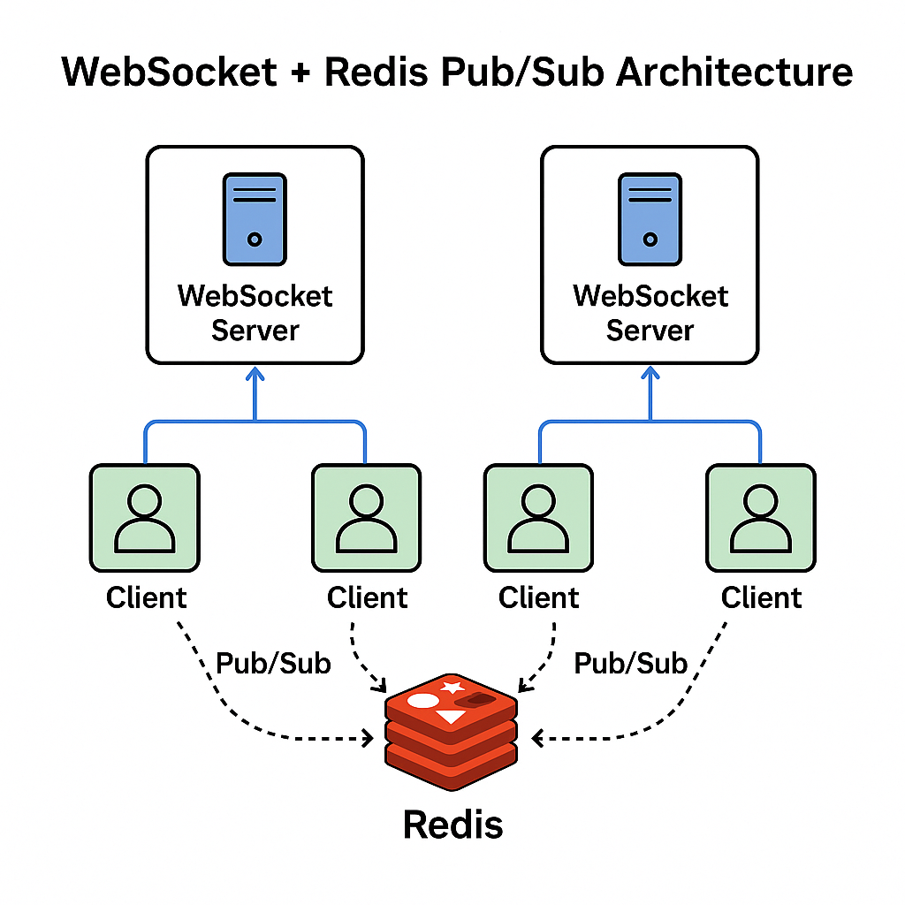
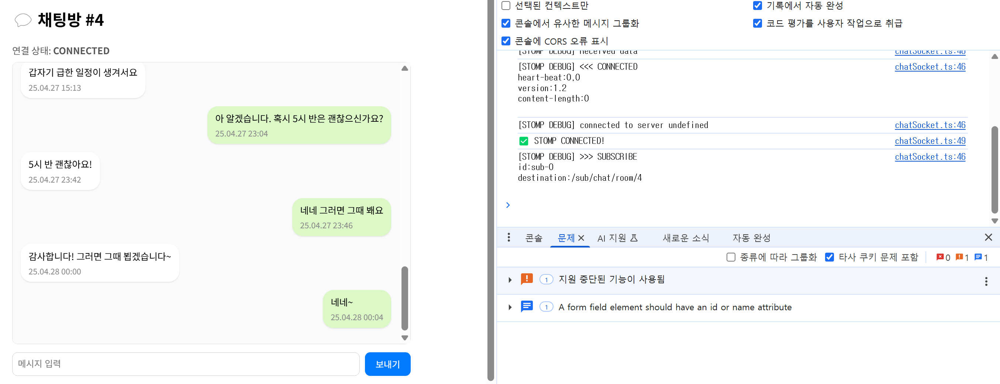
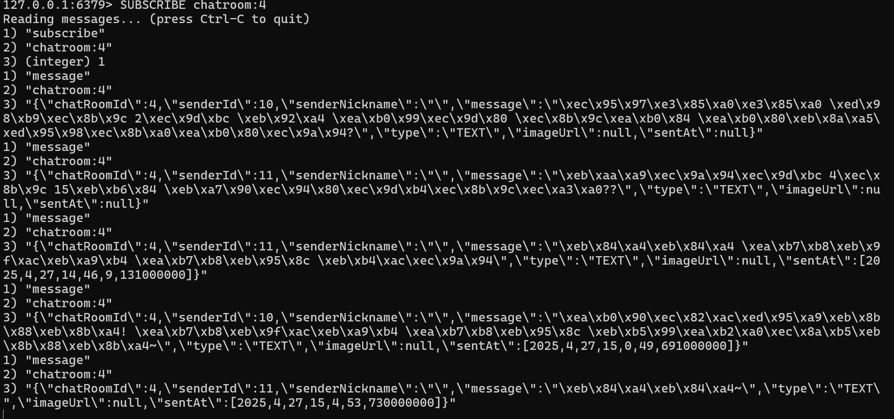
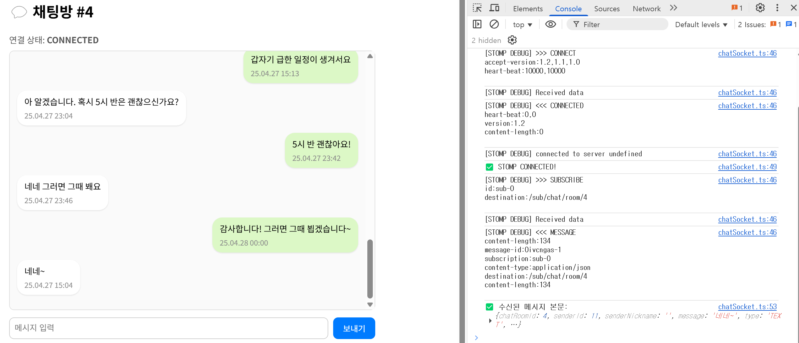

# 💸 MoneyTalk 머니톡

> **소비 분석 기반의 중고거래 & 예산 챗봇 플랫폼**  
> 중고 거래와 지출 관리, 그리고 AI 예산 상담을 하나로 통합한 생활 밀착형 서비스


[](https://github.com/깃허브유저명/레포지토리명/actions)

---

## [ 기능 ]

### # 회원 관리
**사용자 등록 및 인증**
- 회원가입 기능 (이메일, 비밀번호, 닉네임)
- 로그인 / 로그아웃 기능 (JWT 기반)
- 내 정보 조회 및 수정
- 권한 관리 (USER / ADMIN)

> ※ 소셜 로그인, 비밀번호 재설정, 프로필 이미지 등은 향후 확장 가능

### # 중고 거래 시스템
**상품 관리**
- 상품 등록 / 조회 / 수정 / 삭제
- 판매 상태 변경 (판매 중 → 예약 중 → 판매 완료)
- 찜하기 기능

**후기 시스템**
- 거래 완료 후 리뷰 작성 (평점 + 내용)
- 판매자/구매자에 대한 후기 확인

### # 실시간 채팅 시스템
**채팅 기능**
- WebSocket 기반 1:1 실시간 채팅
- Redis Pub/Sub 기반 메시지 송수신
- 채팅방 목록 조회, 메시지 저장

### # 가계부 & 예산 관리 시스템
**지출/수입 기록**
- 금액, 카테고리, 메모, 날짜 등록
- 월별 소비 내역 조회

**예산 설정**
- 사용자별 월 예산 설정
- 예산 초과 시 알림

**소비 분석**
- 카테고리별 소비 통계
- 월별 소비 증감 비교
- 과소비 항목 분석 (TOP 3)

### # AI 예산 챗봇 시스템
**챗봇 예산 상담**
- “이번 달 많이 썼어?”
- “어떻게 줄일 수 있을까?”
- 소비 요약 → ChatGPT API 연동 → 자연어 응답

---
## [ ERD ]



---
## 📁 디렉토리 구조

```
└── src
    ├── config          # Security, WebSocket, JWT 설정 등
    ├── controller      # API 엔드포인트
    ├── domain          # JPA Entity 클래스
    ├── dto             # Request/Response 객체
    ├── repository      # Spring Data JPA 인터페이스
    ├── exception       # 예외처리 계층
    ├── type         	# enum 타입(상품 판매 상태, 유저 타입 등)
    └── service         # 비즈니스 로직 처리 계층
```

---

## ✅ 개발 범위 (4주차 기준)

### 👤 회원 관리
- 회원가입 / 로그인 (JWT 기반)
- 내 정보 조회, 수정
- 기본 프로필 이미지 자동 등록

### 🛍️ 중고 거래
- 상품 등록 / 조회 / 상세 / 찜하기
- 찜 여부 확인 및 토글 API

### ⭐ 리뷰 시스템
- 리뷰 작성 (텍스트 + 이미지 업로드)
- 리뷰 수정 / 삭제 / 목록 / 평균 평점
- S3 이미지 업로드, 삭제 처리

### 💬 실시간 채팅
- WebSocket 기반 실시간 1:1 채팅
- Redis Pub/Sub 기반 메시지 처리
- 채팅방 목록 조회, 채팅방 생성
- 메시지 송수신(Redis pub/sub 기반)


### 미구현
- 채팅방 나가기 (Soft Delete)
- 채팅방 내 이미지 전송 기능 (S3 업로드)
- 찜하기 기능에 Redis ZSet 적용
---

## 🛠️ 기술 스택

### Backend
- Java 17
- Spring Boot
- Spring Security (JWT)
- Spring WebSocket
- Spring Data JPA
- Lombok

### Database
- MySQL
- Redis

### AI 연동
- OpenAI ChatGPT API

### Infra
- AWS (EC2, S3 등)
- Docker (계획)

### 문서화 & 협업
- Swagger (springdoc-openapi)
- GitHub
- Slack
- Notion

---

## 🌐 API 명세
- Swagger UI: `/swagger-ui/index.html`
- JWT 인증 필요 API → Swagger Authorize 버튼 사용 (Bearer token)

---

## [ 개발 계획 - 5주 ]

### 1주차: 기획 및 기본 구조 구축
- 요구사항 분석, ERD 설계
- 프로젝트 구조 세팅
- Spring Boot 기본 설정 (Security, JPA 등)
- 회원가입 / 로그인 기능 구현
- Swagger 문서화 적용

### 2주차: 중고 거래 기능
- 상품 등록 / 조회 / 상세 / 찜하기
- 판매 상태 변경 API
- 리뷰 작성 기능 추가
- 기본 UI 데이터 반환 테스트

### 3주차: 채팅 시스템
- WebSocket 설정
- 채팅방 생성, 메시지 송수신
- Redis Pub/Sub 적용
- 채팅 메시지 저장 로직

### 4주차: 가계부 & 예산 관리
- 수입/지출 등록, 월간 소비 조회
- 예산 설정, 예산 초과 계산
- 카테고리별 소비 통계 분석

### 5주차: 챗봇 연동 & 마무리
- ChatGPT API 연동
- 소비 요약 로직 → AI 응답 생성
- 테스트 코드 정리 및 기능 통합
- 배포 준비 및 최종 README 작성

---

## 🛠 최근 개발 일지 / Troubleshooting

### ✅ 2025-03-28

- Spring Security + JWT 기반 로그인/회원가입 기능 구현 완료
- Swagger UI에 JWT 인증 헤더 적용 (`bearerAuth`)
- GlobalExceptionHandler 구현 완료
- Swagger에서 `RestControllerAdvice` 충돌 발생
  - `springdoc-openapi-starter-webmvc-ui:2.2.0` 사용 시 `NoSuchMethodError` 발생
  - 원인: springdoc와 spring-web 간의 버전 불일치
  - 해결: springdoc-openapi-starter-webmvc-ui를 **2.1.0**으로 다운그레이드

```gradle
// build.gradle 의존성 예시
implementation 'org.springdoc:springdoc-openapi-starter-webmvc-ui:2.1.0'
```

- Swagger 문서에서 GlobalExceptionHandler의 에러 응답 예시 추가 완료
- 향후 기능으로 이메일 인증, Google/Naver/Kakao OAuth 로그인 연동도 계획 중


### ✅ 2025-04-11
## ❤️ 찜하기(좋아요) 기능 설계

### ✅ 구현 목적
- 사용자가 마음에 드는 상품을 저장해두고 나중에 다시 확인할 수 있도록 합니다.
- 상품의 인기 순위를 계산하거나, 사용자 취향 기반 추천에 활용할 수 있습니다.

### 🛠️ 기술 선택 배경

| 구현 방식 | 장점 | 단점 |
|-----------|------|------|
| **📦 DB 기반** (`favorite_products` 테이블 생성) | - 데이터 영속성<br>- 쿼리 확장 용이 (찜 목록, 찜 수 통계)<br>- 관리, 통계 시스템 연계 쉬움 | - 데이터량 증가 시 성능 이슈 가능 |
| **⚡ Redis 기반** (Set/SortedSet 활용) | - 실시간 인기 상품 캐싱 용이<br>- 빠른 응답 속도<br>- 서버 확장성과 캐시 처리에 유리 | - 휘발성 데이터 (재시작 시 초기화)<br>- 복합 쿼리 어려움 |

> ✅ **현재는 안정성과 연동 편의성을 고려해 DB 기반으로 구현**  
> ⏩ 이후 트래픽 증가 시 **Redis 캐싱 구조로 확장 예정**

---

### 📐 테이블 설계 (`favorite_products`)

```sql
Table favorite_products {
  id BIGINT [pk, increment]
  user_id BIGINT [ref: > users.id]
  product_id BIGINT [ref: > products.id]
  created_at DATETIME [default: `CURRENT_TIMESTAMP`]
}
```
---

# 📌 2주차 개발 정리 - 중고 거래 기능

## 🔧 주요 구현 기능

### 1. 상품 등록 / 조회 / 상세 API
- 상품 등록 시 필드: `title`, `description`, `price`, `category`, `location`, `status`
- 상품 전체 목록 조회: `GET /api/products`
- 상품 단건 상세 조회: `GET /api/products/{id}`
- ✅ JWT 인증 기반으로 Swagger 테스트 완료

---

### 2. 찜하기(좋아요) 기능
- 찜 토글 API: `POST /api/wishlist/{productId}`
- 이미 찜한 상품이면 삭제, 아니라면 추가
- 상품 상세 정보 조회 시 찜 여부 반환 포함

---

### 3. 리뷰 작성 / 조회 / 평균 평점
- 리뷰 작성 시 이미지 업로드 지원 (Amazon S3 연동)
  - 다중 이미지 업로드
  - `multipart/form-data` 형식 처리
- 상품별 리뷰 리스트 조회: `GET /api/reviews/products/{productId}`
- 받은 리뷰 목록 조회: `GET /api/reviews/received`
- 평균 평점 조회: `GET /api/reviews/products/{productId}/average`

---

### 4. 구매 확정 및 구매 기록 저장
- 상품 구매 시 `purchase_history` 테이블에 기록 저장
- 추후 가계부 기능과 연동 예정

---

## 🐞 트러블슈팅 기록

## 🔧 리뷰 & 구매 확정 관련 트러블슈팅 모음

### 1. ✅ `@ModelAttribute`와 `@RequestPart` 혼용 문제

- **문제**: 리뷰 작성/수정 시 JSON과 이미지 파일을 동시에 전송하면 `MethodArgumentNotValidException` 발생
- **원인**:
  - DTO를 `@RequestBody`로 받을 수 없고,
  - `multipart/form-data` 요청에서 JSON을 `@ModelAttribute`로 받으려 했지만 validation이 깨짐
- **해결 방법**:
  - DTO에 `@Schema(type = "string")` 명시
  - `@ModelAttribute` 방식으로 처리
  - Swagger에서는 `FormData` 방식으로 각 필드 (`productId`, `targetUserId`, `rating`, `content`)를 수동 입력

---

### 2. ✅ `S3Uploader`에 `deleteFile()` 누락

- **문제**: 리뷰 수정/삭제 시 S3에 업로드된 이미지를 제거해야 하나 관련 메서드 없음
- **해결 방법**:
  - `S3Uploader` 클래스에 `deleteFile(String fileUrl)` 메서드 직접 구현

---

### 3. ✅ `ReviewResponseDto.from()` 관련 오류

- **문제**: Builder에 정의되지 않은 필드를 사용해 `The method X is undefined` 오류 발생
- **해결 방법**:
  - DTO에 누락된 필드들 (`productId`, `targetId`, `reviewerId`, `imageUrls`) 추가
  - Builder에 해당 필드 반영

---

### 4. ✅ 리뷰 단건 조회 및 이미지 리스트 포함 로직

- **문제**: 기존 `ReviewResponseDto.from(Review)`는 이미지 포함 기능이 없어 확장 시 오류 발생
- **해결 방법**:
  - `from(Review, List<String> imageUrls)` 메서드 추가
  - 기존 호출부에서 해당 메서드로 수정

---

### 5. ✅ 리뷰 수정 시 DTO 바인딩 실패

- **문제**: Swagger에서 `@ModelAttribute`로 DTO 파라미터를 넘기지 못해 DTO 값이 null로 들어감
- **해결 방법**:
  - `@ModelAttribute` 방식 유지
  - Swagger에서 `form-data` 형식으로 `rating`, `content` 직접 입력
  - DTO 필드에 `@Schema(type = "string" 또는 "integer")` 명시하여 Swagger 입력 형식 개선

---

### 6. ✅ JWT 인증 관련 오류 (401 Unauthorized)

- **문제**: Swagger에서 토큰 인증했음에도 401 오류 발생
- **해결 방법**:
  - 토큰 만료 여부 확인 (예: JWT 1시간 유효)
  - Swagger 상단 Authorize 클릭 → `Bearer <token>` 형식으로 갱신
  - 백엔드에서 쿠키 기반 인증과 `Authorization` 헤더 인증 병행 처리

---

### 7. ✅ 평균 평점 조회 시 `ClassCastException`

- **문제**: `Object[]`를 직접 캐스팅할 때 `java.lang.ClassCastException` 발생
- **해결 방법**:
  - `List<Object[]>` 형식으로 결과 받기
  - `result[0]`와 `result[1]`을 각각 `Number`로 캐스팅 후  
    `.longValue()` / `.doubleValue()`로 변환하여 사용


## 📌 3주차 개발 정리 - 실시간 채팅 기능

### ✅ 기능 개요
- 상품 상세 페이지에서 판매자와 1:1 채팅방 생성
- STOMP 기반 WebSocket 연결로 실시간 채팅 메시지 송수신
- Redis 없이 순수 STOMP 기반 실시간 전송 처리
- 메시지 읽음 처리, 채팅방 목록 조회, 마지막 메시지 요약 기능 포함
- 채팅방 Soft Delete(사용자별 삭제) 및 재접속 자동 복구 로직 구현

---

### 🧩 주요 API 목록

| 메서드 | URL | 설명 |
|--------|-----|------|
| `POST` | `/api/chatrooms/{productId}` | 채팅방 생성 (구매자 ↔ 판매자) |
| `GET` | `/api/chatrooms` | 내 채팅방 목록 조회 |
| `GET` | `/api/chatrooms/{chatRoomId}/messages` | 채팅방 내 메시지 조회 |
| `PATCH` | `/api/chatrooms/{chatRoomId}/read` | 메시지 읽음 처리 |
| `DELETE` | `/api/chatrooms/{chatRoomId}/leave` | 채팅방 나가기 (Soft Delete) |
| `GET` | `/api/chatrooms/{chatRoomId}/detail` | 채팅방 상세 정보 조회 |
| `POST` | `/chatrooms/{roomId}/image` | 채팅 이미지 업로드 (S3 연동) |
| `@MessageMapping("/chat/message")` | WebSocket 메시지 송신 |

---

### 🧱 기술 스택 및 라이브러리

- Spring Boot 3.x  
- WebSocket + STOMP (`spring-boot-starter-websocket`)  
- SockJS + STOMP.js (프론트엔드 연동)  
- S3Uploader 기반 이미지 업로드 지원  
- 메시지 및 채팅방 엔티티: JPA, MySQL  
- 예외 처리: `@ControllerAdvice`, 커스텀 예외  
- 읽음 처리 및 마지막 메시지 필드 관리

---

### 🔧 설계 흐름 요약

```
[상품 상세] → [채팅 시작 버튼 클릭]
    ↓ (POST)
[ChatRoom 생성 또는 기존 반환]
    ↓ (웹소켓 연결)
[STOMP /sub/chat/room/{roomId} 구독]
    ↕
[메시지 송수신, 읽음 처리, 자동 재연결]
```

- 메시지 전송 시 → DB 저장 → 상대방이 구독 중이면 `/sub/...`로 실시간 전송
- 사용자가 채팅방 나가면 메시지는 Soft Delete 처리 (상대방에게는 남아있음)
- 채팅방 목록은 상대방 닉네임, 썸네일, 마지막 메시지, 읽지 않은 메시지 수 포함

---

### 🖥 프론트엔드 연동 흐름

- `chatSocket.ts`를 통해 `STOMP over SockJS` 연결 관리
- 연결 상태(`CONNECTED`, `RECONNECTING`)를 상태로 표시
- `ChatRoom.tsx`
  - 채팅방 진입 시 메시지 불러오고, `markMessagesAsRead`로 읽음 처리
  - 메시지 전송 시 `sendChatMessage` 호출
  - 메시지 수신 시 실시간 추가 렌더링 및 `scrollToBottom` 처리
- `ChatRoomList.tsx`
  - 5초 주기 `fetchMyChatRooms()`로 목록 갱신
  - 각 채팅방 클릭 시 읽음 처리 후 `/chat/{roomId}`로 이동

---

### 🗃 DB 테이블 구조 (요약)

#### `chat_rooms`
- `id`: PK
- `product_id`: 상품 FK
- `buyer_id`, `seller_id`: 유저 FK
- `last_message`: 마지막 메시지 요약
- `last_message_at`: 마지막 메시지 시간
- `is_closed`: 채팅방 종료 여부

#### `chat_messages`
- `id`: PK
- `chat_room_id`: FK
- `sender_id`, `receiver_id`: 유저 FK
- `message`: 메시지 본문
- `image_url`: 이미지 URL (nullable)
- `type`: TEXT / IMAGE / SYSTEM
- `is_read`: 읽음 여부
- `is_deleted_by_sender`, `is_deleted_by_receiver`: Soft Delete 플래그
- `sent_at`: 발송 시간

---

### 📦 ChatMessage 예시 DTO (응답)

```json
{
  "messageId": 102,
  "senderId": 3,
  "senderNickname": "john_doe",
  "senderProfileImage": "https://...jpg",
  "message": "안녕하세요!",
  "imageUrl": null,
  "type": "TEXT",
  "sentAt": "2025-04-25T13:12:00",
  "isRead": true
}
```

---

### 🧪 테스트 및 예외 처리

- 로그인 사용자 인증 실패 시 `401`
- 채팅방 접근 권한 없음 → `403` 예외
- 메시지 발송 시 `senderId` null 오류 방지 (`JwtHandshakeInterceptor` 활용)
- 이미지 업로드 실패 대비한 예외 처리
- WebSocket 연결 끊김 시 자동 reconnect 및 토스트 메시지 제공

---

### ✨ 추가 개선 아이디어

- Redis Pub/Sub 연동하여 확장성 있는 메시지 브로드캐스팅 구조로 전환 고려
- 메시지 read/unread 상태를 Redis Sorted Set으로 관리해 빠른 조회 가능하도록 개선
- 알림(Notification) 기능과 연계하여 메시지 수신 시 실시간 알림 표시
- 채팅방 내 이미지 미리보기 기능 및 파일 다운로드 기능 추가 예정
- 대화 목록 검색, 채팅방 고정(Pin), 신고 기능 등 커뮤니티 기능 확장 고려

---

## 🛠 주요 TroubleShooting (3주차)

### 1. WebSocket 세션에서 로그인 유저 정보가 안 들어옴
- `@AuthenticationPrincipal`이 null로 반환되는 문제
- ✅ 해결: `JwtHandshakeInterceptor` 구현 → STOMP 연결 시 JWT 파싱하여 `Principal`로 주입

### 2. 메시지 전송 시 senderId가 null로 저장됨
- 클라이언트에서 전달된 senderId만 의존했기 때문
- ✅ 해결: 백엔드에서 로그인한 사용자 기준으로 sender 설정 → 보안 강화

### 3. 이미지 전송 메시지에 텍스트가 null로 들어가면서 UI 오류 발생
- ✅ 해결: 이미지 메시지일 경우 `message = "[이미지]"` 로 대체 저장

---

## 🔧 리팩토링 이력 (피드백 기반)

### ✅ 1. 명시적 응답 타입 적용 (`ResponseEntity`)
- `<?>` 사용 대신 `ResponseEntity<LoginResponse>` 명확화

### ✅ 2. JWT 쿠키 처리 로직 분리 (`JwtCookieProvider`)
- 쿠키 발급/삭제 로직을 별도 컴포넌트로 추출
- 환경 변수(`COOKIE_SECURE`) 기반 secure 동적 제어

### ✅ 3. 리뷰 통계 응답 구조 개선
- `Object[]` 반환 제거 → `ReviewStatsDto`로 직접 DTO 매핑
- 응답용 DTO는 `AverageRatingResponseDto`로 분리

### ✅ 4. 도메인 필드 및 네이밍 통일
- `Review.target` → `reviewee`로 리팩토링
- 컬럼명도 `target_id` → `reviewee_id`로 변경
- 외래 키 이름도 `fk_reviews_reviewee`로 재설정

---

## 📦 4~5주차 - 예산 기반 가계부 & 소비 요약 기능

### ✅ 기능 개요
- 사용자는 월별로 수입/지출 내역을 등록하고, 예산을 설정할 수 있음
- 월간 총 지출과 예산을 비교하여 예산 초과 여부를 판단
- 카테고리별로 지출을 집계하여 시각화 및 소비 분석에 활용 가능
- OpenAI ChatGPT 연동을 통해 소비 내역을 자연어로 요약하여 제공

---

### 🧩 주요 API 목록

| 메서드 | URL | 설명 |
|--------|-----|------|
| `POST` | `/api/accountbook` | 수입/지출 등록 |
| `GET` | `/api/accountbook?month=YYYY-MM` | 수입/지출 월별 조회 |
| `GET` | `/api/accountbook/summary?month=YYYY-MM` | 카테고리별 합계, 예산 초과 여부 포함 요약 |
| `POST` | `/api/budget` | 예산 등록 또는 수정 |
| `GET` | `/api/budget?month=YYYY-MM` | 월별 예산 조회 |
| `GET` | `/api/chatbot/summary?month=YYYY-MM` | ChatGPT 소비 요약 텍스트 생성 |

---

### 🧱 기술 스택 및 라이브러리

- Spring Boot 3.x
- JPA + MySQL
- REST API 기반 CRUD
- OpenAI ChatGPT (gpt-3.5-turbo) API 연동
- 환경 변수 기반 API Key 관리 (`openai.api.key`)
- Swagger UI로 API 명세 확인

---

### 🧪 테스트 및 검증

- LedgerService, BudgetService, ChatbotService 각각 단위 테스트 완료
- RestTemplate과 @Value 주입 필드를 위한 `ReflectionTestUtils` 사용
- ChatGPT 요약 로직은 응답 Mock을 통해 안정적인 테스트 수행

---

### ✨ 주요 기능 흐름

```
[사용자 수입/지출 등록]
        ↓
[LedgerService → 월별 집계, 카테고리별 요약]
        ↓
[BudgetService → 예산 조회 및 초과 여부 판단]
        ↓
[ChatbotService → 프롬프트 생성 → GPT API 요청]
        ↓
[소비 요약 텍스트 반환 → 프론트 표시]
```

- 예산이 초과되었는지 여부를 포함하여 월별 소비 내역을 정리
- GPT는 "이번 달 예산을 초과했으며 식비 지출이 높습니다" 형태로 요약 출력

---

### 📊 예시 응답 (ChatbotSummaryResponseDto)

```json
{
  "summary": "이번 달 예산을 초과했으며, 특히 '식비'와 '쇼핑'에서 많은 지출이 있었습니다."
}
```

---

### 📦 DB 테이블 요약

#### `ledgers`
- `id`, `user_id`, `type(INCOME/EXPENSE)`, `amount`, `category`, `memo`, `date`, `created_at`

#### `budgets`
- `id`, `user_id`, `month(YYYY-MM)`, `amount`, `created_at`

---

### 🛠 TroubleShooting

1. **OpenAI API 호출 시 401 Unauthorized**
   - ✅ 해결: `application.yml`에 `${OPENAI_API_KEY}` 환경변수로 키 주입

2. **RestTemplate 필드 주입이 테스트에서 안 됨**
   - ✅ 해결: `ReflectionTestUtils.setField()` 사용해 Mock 객체 주입

3. **예산이 없을 때 NPE 발생**
   - ✅ 해결: `Optional.orElse(0)`로 기본값 처리 또는 0 예산 응답 제공

---

## 📌 4주차 개발 정리 - Redis 기반 구조 적용

- **Redis Pub/Sub 기반 다중 서버 대응 실시간 채팅 기능 구현**
  - Redis Channel 구조: `chatroom:{chatRoomId}`
  - 메시지 흐름: 클라이언트 → WebSocket `/pub/chat/pub` → 서버 Redis Publish → 서버 Redis Subscribe → 클라이언트 `/sub/chat/room/{roomId}`
  - 서버 수평 확장 대비 구조 완성
  - LocalDateTime 직렬화 이슈 해결 (jackson-datatype-jsr310 모듈 적용)
  - Redis CLI를 통한 publish/subscribe 정상 작동 테스트 완료

---

# 📱 실시간 채팅 구조 선택: WebSocket vs Redis Pub/Sub

## 🔍 비교 대상

| 항목                  | WebSocket 단독 | WebSocket + Redis Pub/Sub |
|-----------------------|----------------|----------------------------|
| 메시지 처리 방식        | 서버 메모리 기반 직접 처리 | Redis를 통한 Pub/Sub 중계 |
| 확장성                  | 서버 1대 기준 최적화 | 서버 단중화 및 분산 환경 최적화 |
| 평균 전송 지역 시간 (ms) | 약 28~30ms      | 약 32~35ms                 |
| 장애 복원력             | 낮음             | 높음 ( 서버 간 보관 가능)     |

---

## 📊 실제 테스트 결과

- **WebSocket 단독 처리**:  
  - 평균 메시지 전송 지역 시간: 약 **28~30ms**
  - 서버 메모리에서 직접 메시지를 송수신하는 구조
  - 단일 서버에서는 빠른데, 서버가 들어가면 세션 관리가 어려워진다.

- **WebSocket + Redis Pub/Sub 처리**:  
  - 평균 메시지 전송 지역 시간: 약 **32~35ms**
  - Redis를 통해 모든 서버가 메시지를 중계받는 구조
  - 다중 서버 환경(Scale-out)에서도 안정적으로 작동
  - 단일 서버 기준으로는 Redis publish 과정 추가로 Websocket보다 느리지만, 서버가 2개 이상 생길 경우 장애 복구, 부하 분산 등 이점 다수
  - Pub/Sub 특성상 서버 간 연결 관리 없이 메시지 전달 가능

---

## 🛡️ Redis Pub/Sub를 선택한 이유

1. **성능 감소**
   - WebSocket의 경우, 사용자가 접속한 서버가 다를 경우 서버 재접속으로 수백 ms의 손실 발생
   - Redis의 경우 장애 없음, 대량 메시지 처리시 분산 효과 기대

2. **확장성과 유연성**
   - 서버 인스턴스가 증가할 경우에도 세션 공유(Sticky Session) 없이 자유롭게 채팅 데이터 공유
   - 수평 확장이 필요한 환경에서 Redis Pub/Sub가 필수적
     
3. **장애 대응성**
   - 하나의 서버에 문제가 생겨도 다른 서버가 메시지 전송을 계속 이어갈 수 있음
   - Redis의 클러스터링 및 복제 기능 활용 가능

4. **구현 난이도 대비 효과**
   - 기존 WebSocket 구조에 Redis Pub/Sub만 추가해도 큰 효과를 볼 수 있음
   - 코드 변경 최소화, 서비스 신뢰성 대폭 향상


---

## 🚀 결론

WebSocket만 사용할 경우 **단일 서버**에서는 간단하지만,  
**확장성** 또는 **안정성**을 고려할 경우 Redis Pub/Sub 구조가 명확한 이점을 보여주었습니다.

따라서, 이 프로젝트에서는  
✅ **Redis Pub/Sub**를 기반으로 한 실시간 채팅 구조를 최종 선택하였습니다.


---

## 🚀 CI/CD & 배포 자동화

### ✅ CI (GitHub Actions 기반)

* `main` 또는 `feature/**` 브랜치 Push 시 자동으로 동작
* Gradle 빌드 및 테스트, Redis 서비스 포함
* Jacoco를 통한 테스트 커버리지 리포트 생성
* GitHub Secrets로 환경 변수 관리
* 하위 디렉토리 대응을 위한 `working-directory` 설정 포함

```yaml
defaults:
  run:
    working-directory: moneytalk
```

### 📈 Test Coverage (Jacoco)

* `jacocoTestReport` → HTML 리포트 자동 생성 (`/build/reports/...`)
* `finalizedBy` 설정을 통해 테스트 후 리포트 자동 실행

### 🐳 Docker & Compose

* 경량 Alpine 기반 JDK 이미지 사용
* 빌드된 JAR 파일을 `app.jar`로 복사하여 실행

```dockerfile
FROM eclipse-temurin:17-jdk-alpine
ARG JAR_FILE=build/libs/moneytalk-0.0.1-SNAPSHOT.jar
COPY ${JAR_FILE} app.jar
ENTRYPOINT ["java", "-jar", "app.jar"]
```

* `docker-compose.yml` 내 Redis, App 통합 및 포트 매핑

### ☁️ CD (EC2 자동 배포 성공 사례)

* GitHub Actions 내 `deploy.yml` 워크플로에서 배포 자동화 완료
* DockerHub에서 최신 이미지 Pull 후 실행

```yaml
- name: Deploy to EC2
  uses: appleboy/ssh-action@master
  with:
    host: ${{ secrets.EC2_HOST }}
    username: ec2-user
    key: ${{ secrets.EC2_KEY }}
    script: |
      docker pull kdhdaniel/moneytalk-backend:latest
      cd ~/moneytalk-deploy
      docker-compose down
      docker-compose up -d
```

✅ `git push` → CI → DockerHub Push → EC2 배포까지 자동화 완료

---

### 🐞 TroubleShooting 기록

#### 1. `COPY` 실패 오류 (Dockerfile)

* 경로 문제 → working-directory 누락으로 인한 jar 경로 mismatch
* 해결: `defaults.run.working-directory` 설정 추가

#### 2. Redis `localhost` 연결 실패

* 컨테이너 내부는 자기 자신을 의미 → `redis.host=redis` 로 수정 필요

#### 3. GitHub Actions 환경 변수 오류

* `.env` 미적용 상태에서 실행되어 오류 → `secrets` 로 주입 해결

#### 4. SSH 접속 오류

* pem 권한 (`chmod 400`) 또는 포트 허용 누락 → EC2 보안 그룹 확인

---

### 🐋 DockerHub 자동 Push 설정

```yaml
- name: Log in to DockerHub
  uses: docker/login-action@v3
  with:
    username: ${{ secrets.DOCKER_USERNAME }}
    password: ${{ secrets.DOCKER_PASSWORD }}

- name: Build and Push Docker Image
  run: |
    docker build -t kdhdaniel/moneytalk-backend:latest .
    docker push kdhdaniel/moneytalk-backend:latest
```

* DockerHub에 최신 이미지 자동 업로드
* EC2에서 Pull → Compose로 실행 가능

✅ 개발 → Push → DockerHub → EC2 자동 배포 파이프라인 완성

---
# 📷 데모 스크린샷

- ✅ 프론트 채팅 전송 화면

- ✅ Redis-cli publish 수신 화면

- ✅ 상대방 실시간 수신(새로고침 없이 즉시 반영) 화면


---

## 🧠 기술적 회고

### 1. 잘한 점
- GitHub Actions 기반 CI 구축으로 코드 변경 시 빌드 안정성 확보
- WebSocket, Redis Pub/Sub을 직접 구성하며 실시간 시스템 설계 경험
- 가계부/예산/소비 분석을 통해 실생활과 밀접한 데이터 처리 로직 구성
- OpenAI API 연동을 통해 외부 API 활용 능력 강화

### 2. 아쉬운 점
- 초기 ERD 설계 변경이 잦아 불필요한 수정 작업이 많았음
- JWT 인증/인가 로직을 더 세분화하지 못해 Role 분기 구현이 제한적이었음
- 대규모 데이터 및 트래픽에 대비한 캐시 구조 최적화는 미흡

### 3. 성장 포인트
- Docker, AWS EC2 배포 자동화 (CD) 추가 예정
- 채팅 기능 고도화 (읽음 처리 최적화, Soft Delete 강화)
- Redis 기반 인기 상품 집계, 소비 패턴 분석 고도화 예정

---

## ⚙️ 개발 및 배포 환경

- GitHub Actions 기반 CI 구축 (백엔드 빌드 자동화)


---

# 📌 요약

- ✅ 1인 개발로 기획 → 설계 → 개발 → 테스트 → 배포(준비)까지 전 과정 수행
- ✅ 주요 기술스택(Spring Boot, Redis, OpenAI API, AWS) 실전 적용
- ✅ CI 구축 완료
---

# ✨ 차후 계획

- Redis 기반 소비 패턴 알림 기능 강화
- 예산 초과 자동 경고 시스템 구축
- 사용자별 맞춤 소비 추천 기능 추가
- Spring Batch를 활용한 소비 데이터 분석 자동화
- ChatGPT 기반 자연어 금융 상담 기능 확장
