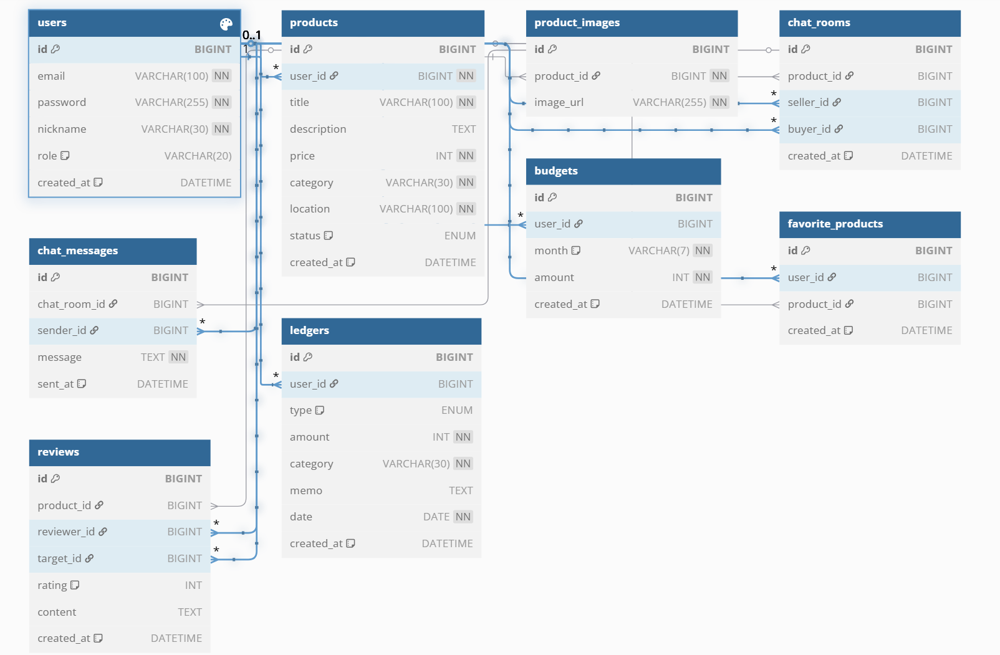

# 💸 MoneyTalk 머니톡

> **소비 분석 기반의 중고거래 & 예산 챗봇 플랫폼**  
> 중고 거래와 지출 관리, 그리고 AI 예산 상담을 하나로 통합한 생활 밀착형 서비스


---

## [ 기능 ]

### # 회원 관리
**사용자 등록 및 인증**
- 회원가입 기능 (이메일, 비밀번호, 닉네임)
- 로그인 / 로그아웃 기능 (JWT 기반)
- 내 정보 조회 및 수정
- 권한 관리 (USER / ADMIN)

> ※ 소셜 로그인, 비밀번호 재설정, 프로필 이미지 등은 향후 확장 가능

### # 중고 거래 시스템
**상품 관리**
- 상품 등록 / 조회 / 수정 / 삭제
- 판매 상태 변경 (판매 중 → 예약 중 → 판매 완료)
- 찜하기 기능

**후기 시스템**
- 거래 완료 후 리뷰 작성 (평점 + 내용)
- 판매자/구매자에 대한 후기 확인

### # 실시간 채팅 시스템
**채팅 기능**
- WebSocket 기반 1:1 실시간 채팅
- Redis Pub/Sub 기반 메시지 송수신
- 채팅방 목록 조회, 메시지 저장

### # 가계부 & 예산 관리 시스템
**지출/수입 기록**
- 금액, 카테고리, 메모, 날짜 등록
- 월별 소비 내역 조회

**예산 설정**
- 사용자별 월 예산 설정
- 예산 초과 시 알림

**소비 분석**
- 카테고리별 소비 통계
- 월별 소비 증감 비교
- 과소비 항목 분석 (TOP 3)

### # AI 예산 챗봇 시스템
**챗봇 예산 상담**
- “이번 달 많이 썼어?”
- “어떻게 줄일 수 있을까?”
- 소비 요약 → ChatGPT API 연동 → 자연어 응답

---
## [ ERD ]



---

## [ 기술 스택 ]

### 백엔드
- Java 17
- Spring Boot
- Spring Security (JWT)
- Spring WebSocket
- Spring Data JPA
- Lombok

### 데이터베이스
- MySQL
- Redis

### AI 연동
- OpenAI ChatGPT API

### 인프라 (계획)
- Docker
- AWS (EC2, S3 등)

### 문서화 & 협업
- Swagger (springdoc-openapi)
- GitHub, Slack, Notion

---

## [ 개발 계획 - 5주 ]

### 1주차: 기획 및 기본 구조 구축
- 요구사항 분석, ERD 설계
- 프로젝트 구조 세팅
- Spring Boot 기본 설정 (Security, JPA 등)
- 회원가입 / 로그인 기능 구현
- Swagger 문서화 적용

### 2주차: 중고 거래 기능
- 상품 등록 / 조회 / 상세 / 찜하기
- 판매 상태 변경 API
- 리뷰 작성 기능 추가
- 기본 UI 데이터 반환 테스트

### 3주차: 채팅 시스템
- WebSocket 설정
- 채팅방 생성, 메시지 송수신
- Redis Pub/Sub 적용
- 채팅 메시지 저장 로직

### 4주차: 가계부 & 예산 관리
- 수입/지출 등록, 월간 소비 조회
- 예산 설정, 예산 초과 계산
- 카테고리별 소비 통계 분석

### 5주차: 챗봇 연동 & 마무리
- ChatGPT API 연동
- 소비 요약 로직 → AI 응답 생성
- 테스트 코드 정리 및 기능 통합
- 배포 준비 및 최종 README 작성

---

## 🛠 최근 개발 일지 / Troubleshooting

### ✅ 2025-03-28

- Spring Security + JWT 기반 로그인/회원가입 기능 구현 완료
- Swagger UI에 JWT 인증 헤더 적용 (`bearerAuth`)
- GlobalExceptionHandler 구현 완료
- Swagger에서 `RestControllerAdvice` 충돌 발생
  - `springdoc-openapi-starter-webmvc-ui:2.2.0` 사용 시 `NoSuchMethodError` 발생
  - 원인: springdoc와 spring-web 간의 버전 불일치
  - 해결: springdoc-openapi-starter-webmvc-ui를 **2.1.0**으로 다운그레이드

```gradle
// build.gradle 의존성 예시
implementation 'org.springdoc:springdoc-openapi-starter-webmvc-ui:2.1.0'
```

- Swagger 문서에서 GlobalExceptionHandler의 에러 응답 예시 추가 완료
- 향후 기능으로 이메일 인증, Google/Naver/Kakao OAuth 로그인 연동도 계획 중


### ✅ 2025-04-11
## ❤️ 찜하기(좋아요) 기능 설계

### ✅ 구현 목적
- 사용자가 마음에 드는 상품을 저장해두고 나중에 다시 확인할 수 있도록 합니다.
- 상품의 인기 순위를 계산하거나, 사용자 취향 기반 추천에 활용할 수 있습니다.

### 🛠️ 기술 선택 배경

| 구현 방식 | 장점 | 단점 |
|-----------|------|------|
| **📦 DB 기반** (`favorite_products` 테이블 생성) | - 데이터 영속성<br>- 쿼리 확장 용이 (찜 목록, 찜 수 통계)<br>- 관리, 통계 시스템 연계 쉬움 | - 데이터량 증가 시 성능 이슈 가능 |
| **⚡ Redis 기반** (Set/SortedSet 활용) | - 실시간 인기 상품 캐싱 용이<br>- 빠른 응답 속도<br>- 서버 확장성과 캐시 처리에 유리 | - 휘발성 데이터 (재시작 시 초기화)<br>- 복합 쿼리 어려움 |

> ✅ **현재는 안정성과 연동 편의성을 고려해 DB 기반으로 구현**  
> ⏩ 이후 트래픽 증가 시 **Redis 캐싱 구조로 확장 예정**

---

### 📐 테이블 설계 (`favorite_products`)

```sql
Table favorite_products {
  id BIGINT [pk, increment]
  user_id BIGINT [ref: > users.id]
  product_id BIGINT [ref: > products.id]
  created_at DATETIME [default: `CURRENT_TIMESTAMP`]
}
```
---

# 🛍️ MoneyTalk - 2주차 백엔드 개발 정리

## 🔧 주요 구현 기능

### 1. 상품 등록 / 조회 / 상세 API
- 상품 등록 시 필드: `title`, `description`, `price`, `category`, `location`, `status`
- 상품 전체 목록 조회: `GET /api/products`
- 상품 단건 상세 조회: `GET /api/products/{id}`
- ✅ JWT 인증 기반으로 Swagger 테스트 완료

---

### 2. 찜하기(좋아요) 기능
- 찜 토글 API: `POST /api/wishlist/{productId}`
- 이미 찜한 상품이면 삭제, 아니라면 추가
- 상품 상세 정보 조회 시 찜 여부 반환 포함

---

### 3. 리뷰 작성 / 조회 / 평균 평점
- 리뷰 작성 시 이미지 업로드 지원 (Amazon S3 연동)
  - 다중 이미지 업로드
  - `multipart/form-data` 형식 처리
- 상품별 리뷰 리스트 조회: `GET /api/reviews/products/{productId}`
- 받은 리뷰 목록 조회: `GET /api/reviews/received`
- 평균 평점 조회: `GET /api/reviews/products/{productId}/average`

---

### 4. 구매 확정 및 구매 기록 저장
- 상품 구매 시 `purchase_history` 테이블에 기록 저장
- 추후 가계부 기능과 연동 예정

---

## 🐞 트러블슈팅 기록

## 🔧 리뷰 & 구매 확정 관련 트러블슈팅 모음

### 1. ✅ `@ModelAttribute`와 `@RequestPart` 혼용 문제

- **문제**: 리뷰 작성/수정 시 JSON과 이미지 파일을 동시에 전송하면 `MethodArgumentNotValidException` 발생
- **원인**:
  - DTO를 `@RequestBody`로 받을 수 없고,
  - `multipart/form-data` 요청에서 JSON을 `@ModelAttribute`로 받으려 했지만 validation이 깨짐
- **해결 방법**:
  - DTO에 `@Schema(type = "string")` 명시
  - `@ModelAttribute` 방식으로 처리
  - Swagger에서는 `FormData` 방식으로 각 필드 (`productId`, `targetUserId`, `rating`, `content`)를 수동 입력

---

### 2. ✅ `S3Uploader`에 `deleteFile()` 누락

- **문제**: 리뷰 수정/삭제 시 S3에 업로드된 이미지를 제거해야 하나 관련 메서드 없음
- **해결 방법**:
  - `S3Uploader` 클래스에 `deleteFile(String fileUrl)` 메서드 직접 구현

---

### 3. ✅ `ReviewResponseDto.from()` 관련 오류

- **문제**: Builder에 정의되지 않은 필드를 사용해 `The method X is undefined` 오류 발생
- **해결 방법**:
  - DTO에 누락된 필드들 (`productId`, `targetId`, `reviewerId`, `imageUrls`) 추가
  - Builder에 해당 필드 반영

---

### 4. ✅ 리뷰 단건 조회 및 이미지 리스트 포함 로직

- **문제**: 기존 `ReviewResponseDto.from(Review)`는 이미지 포함 기능이 없어 확장 시 오류 발생
- **해결 방법**:
  - `from(Review, List<String> imageUrls)` 메서드 추가
  - 기존 호출부에서 해당 메서드로 수정

---

### 5. ✅ 리뷰 수정 시 DTO 바인딩 실패

- **문제**: Swagger에서 `@ModelAttribute`로 DTO 파라미터를 넘기지 못해 DTO 값이 null로 들어감
- **해결 방법**:
  - `@ModelAttribute` 방식 유지
  - Swagger에서 `form-data` 형식으로 `rating`, `content` 직접 입력
  - DTO 필드에 `@Schema(type = "string" 또는 "integer")` 명시하여 Swagger 입력 형식 개선

---

### 6. ✅ JWT 인증 관련 오류 (401 Unauthorized)

- **문제**: Swagger에서 토큰 인증했음에도 401 오류 발생
- **해결 방법**:
  - 토큰 만료 여부 확인 (예: JWT 1시간 유효)
  - Swagger 상단 Authorize 클릭 → `Bearer <token>` 형식으로 갱신
  - 백엔드에서 쿠키 기반 인증과 `Authorization` 헤더 인증 병행 처리

---

### 7. ✅ Spring Data JPA 쿼리 메서드 오류

- **문제**: `existsByUserIdAndProductId()` 메서드에서 `userId`를 필드로 인식하지 못함  
  > `No property 'userId' found for type`
- **해결 방법**:
  - 실제 필드명이 `user`이므로  
    → 메서드를 `existsByUser_IdAndProduct_Id()` 형식으로 작성해야 인식됨

---

### 8. ✅ 평균 평점 조회 시 `ClassCastException`

- **문제**: `Object[]`를 직접 캐스팅할 때 `java.lang.ClassCastException` 발생
- **해결 방법**:
  - `List<Object[]>` 형식으로 결과 받기
  - `result[0]`와 `result[1]`을 각각 `Number`로 캐스팅 후  
    `.longValue()` / `.doubleValue()`로 변환하여 사용

## 🚧 다음 목표 (예정)

- 🔍 **상품 검색 및 필터 기능 추가**  
  사용자 검색어 및 조건(카테고리, 위치 등)에 따른 상품 필터링 기능 제공

- ❤️ **찜한 상품 리스트 조회 기능**  
  사용자가 찜한 상품 목록을 별도로 조회할 수 있는 API 구현
